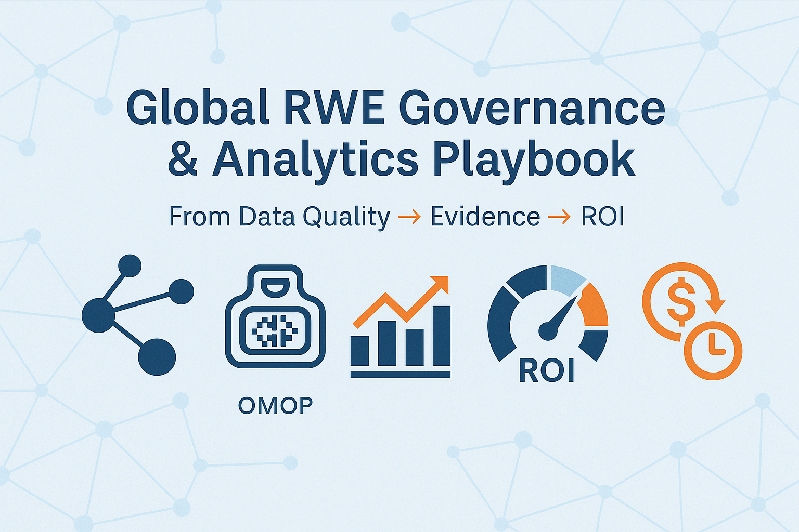

# RWE-governance-and-analytics-playbook-openFDA-clinicaltrials-CDC-OMOP-FHIR-ROI
A comprehensive playbook combining governance frameworks, analytics methodologies, interoperability standards (OMOP/FHIR), and real-world data sources (OpenFDA, ClinicalTrials.gov, CDC) with ROI modeling.

**Focus:** Enterprise governance, interoperability, and strategic enablement for **Real-World Evidence (RWE)**



---

## 🌍 Why this matters

Pharma and biotech companies face growing demand to deliver **trustworthy, reproducible evidence** from **Real-World Data (RWD)**.  
Regulators and payers are scrutinizing **governance, interoperability, and bias mitigation** while business leaders want to see **time-to-value and ROI**.

This repository is a **leadership-oriented playbook** to show how to move from **data → evidence → impact**, using public datasets and practical scorecards.

---

## 📖 Overview

This repo is a **hands-on playbook** for leaders, scientists, and data stewards who need to:

- Assess **fitness-for-use** of RWE/RWD sources  
- Translate **governance metrics** (completeness, timeliness, conformity) into strategic decisions  
- Check **standards alignment** (OMOP vocabularies, FHIR structures)  
- Model **business impact** (ROI of RWE enablement)  
- Communicate results in a **beginner-friendly PDF report**  

The workflow is built with Jupyter notebooks, minimal Python helpers, and published outputs (CSV, JSON, PDF). No Streamlit app required.

---

## 🗂️ Repo Structure

```text
global-rwe-governance-playbook/
│
├── notebooks/
│   ├── 01_openfda_governance_scorecard.ipynb
│   ├── 02_ctgov_portfolio_and_roi.ipynb
│   ├── 03_cdc_public_health_signals.ipynb
│   └── 04_omop_fhir_conformity_checks.ipynb
│
├── scripts/
│   ├── scorecard.py   # governance + conformity helpers
│   └── roi.py         # ROI modeling utilities
│
├── data/              # outputs cached here
│   ├── openfda_flat.csv
│   ├── ctgov_v2_oncology_flat.csv
│   ├── cdc_cases_summary.json
│   └── governance_conformity_report.json
│
├── reports/
│   └── rwe_governance_report.pdf   # auto-generated beginner-friendly report
│
├── rwe_governance_checklist.md     # qualitative governance checklist
├── data_stewardship_policy.md      # organizational policy template
└── README.md
```
## 🚀 Quickstart

### 1. Clone & setup
```bash
git clone https://github.com/camontefusco/global-rwe-governance-playbook.git
cd global-rwe-governance-playbook
pip install -r requirements.txt
```
### 2. ▶️ Run the notebooks in order

1. `01_openfda_governance_scorecard.ipynb` → fetch & score OpenFDA data  
2. `02_ctgov_portfolio_and_roi.ipynb` → query trials, model ROI scenarios  
3. `03_cdc_public_health_signals.ipynb` → pull public health signals  
4. `04_omop_fhir_conformity_checks.ipynb` → merge, assess conformity, export report  

---

## 3. 📤 Outputs

- **CSVs** (flattened datasets) → in `data/`  
- **JSONs** (metrics summaries, conformity results) → in `data/`  
- **PDF Report** (executive-ready, beginner-friendly) → `reports/rwe_governance_report.pdf`  

---

## 📊 Governance Scorecard

Each dataset (OpenFDA, CT.gov, CDC) is profiled across:

| Metric       | Meaning                                   |
|--------------|-------------------------------------------|
| Completeness | % of required fields populated            |
| Consistency  | Schema/key duplication checks             |
| Timeliness   | % of rows updated within recent window    |
| Conformity   | Alignment with expected schema            |
| Standards    | OMOP vocabulary use + FHIR structure      |

Scores are normalized 0–1 and combined into an **overall readiness score**.

---

## 🧬 Standards Conformity (OMOP/FHIR)

- **OMOP vocab** → Detects MedDRA (adverse events), ICD-10 (trial conditions), RxNorm (medications), ISO-3166 (countries).  
- **FHIR struct** → Checks if datasets resemble FHIR resources:  
  - `AdverseEvent` → OpenFDA  
  - `ResearchStudy` → CT.gov  
  - `Observation` → CDC  

---

## 💰 ROI Modeling

Notebook 02 + `scripts/roi.py` show how **RWE enablement translates to business value**:

- **Savings** → lower trial execution costs  
- **Time-to-market benefit** → discounted value of months saved  
- **EV uplift** → increased probability of regulatory/payer acceptance  

---

## 📑 Reports & Policies

- **`reports/rwe_governance_report.pdf`**  
  Beginner-friendly output for first-timers: what was done, how, results, recommendations, and next actions.  

- **`rwe_governance_checklist.md`**  
  Qualitative intake checklist: purpose, rights, provenance, standards, bias control, compliance.  

- **`data_stewardship_policy.md`**  
  Defines roles (Data Owner, Data Steward, Method Lead), minimum governance controls, and when to apply the scorecard.  

---

## 🧭 Talking Points for Leadership

- **From governance to value** → Data quality and provenance drive evidentiary readiness; ROI lens translates readiness into time, cost, and success outcomes.  
- **Interoperability at scale** → Scorecard includes OMOP/FHIR/vocabulary conformity, anticipating regulatory expectations.  
- **Bias-aware by design** → Checklists formalize confounding strategies, sensitivity analyses, and negative controls.  
- **Enablement & adoption** → Templates and reports lower the barrier for clinical, regulatory, HEOR, and market access teams.  

---

## 🛠️ Next Steps

- Automate notebook execution (e.g., `make report`)  
- Extend privacy checks (GDPR, HIPAA)  
- Add payer evidence heuristics to ROI  
- Broaden public health feeds beyond CDC (ECDC, WHO dashboards)  

---

## 📬 Contact
Carlos Montefusco
📧 cmontefusco@gmail.com
🔗 GitHub: /camontefusco
